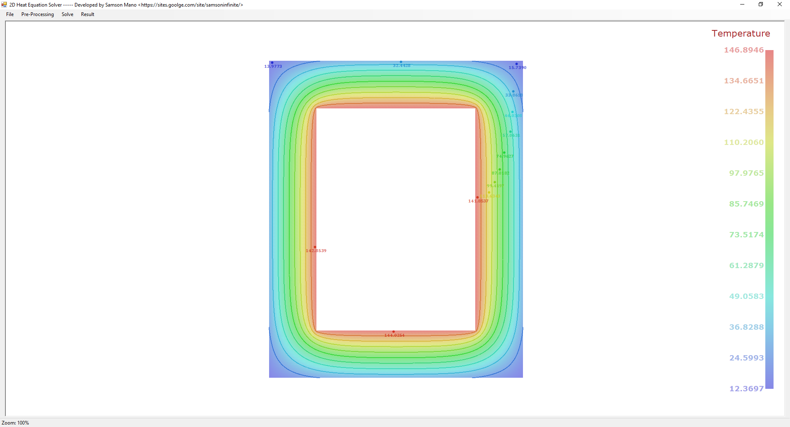
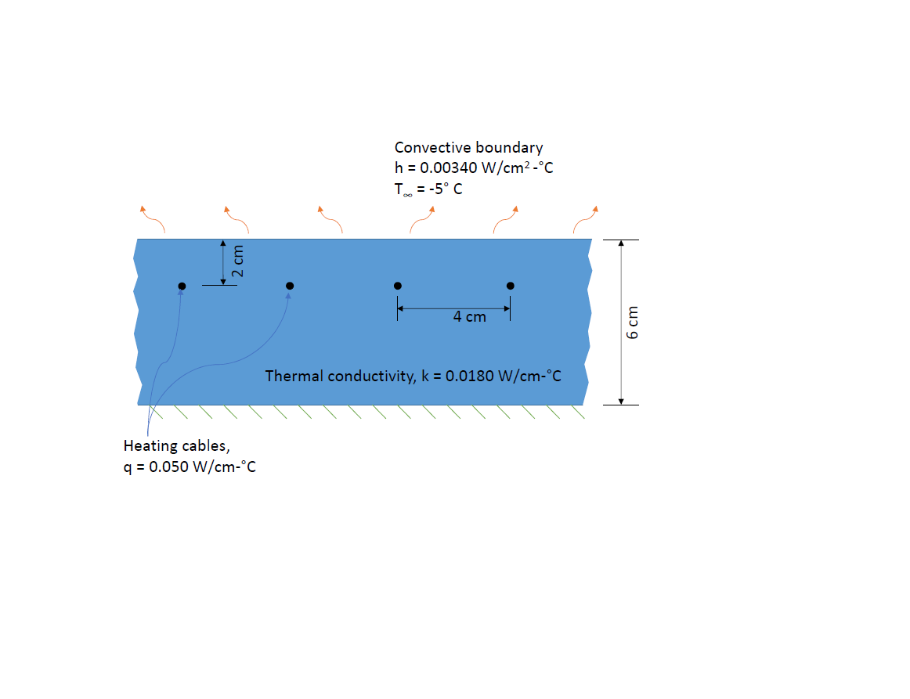
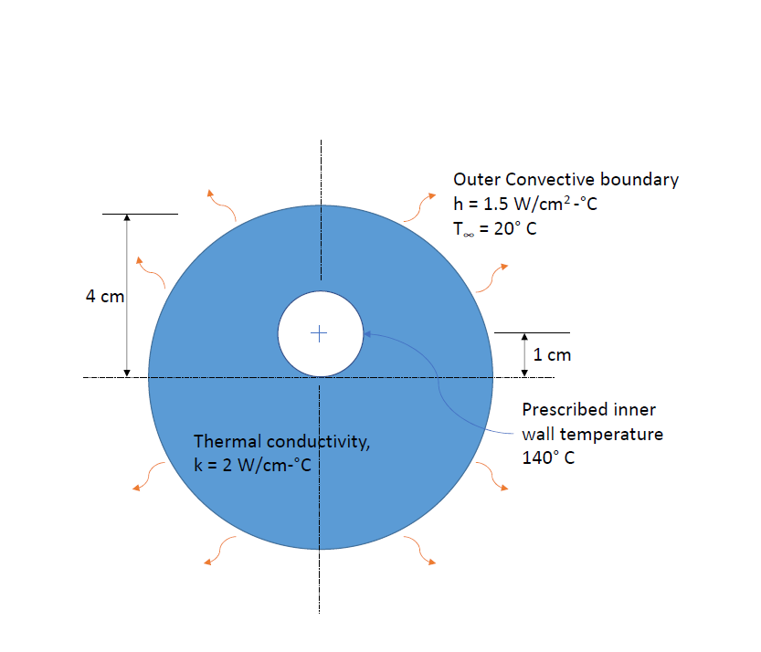
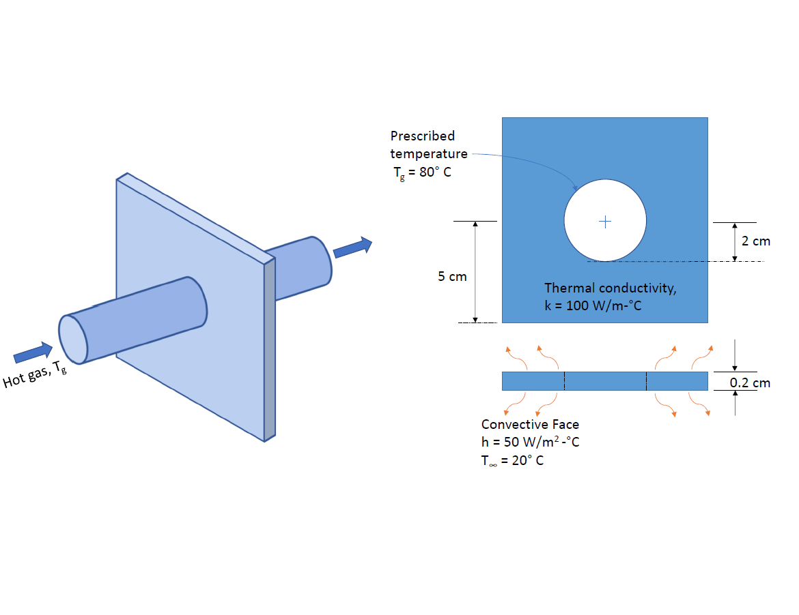

# 2D Heat transfer solver (Superseeded)

IMPORTANT!!!!!!
This repository is no longer actively maintained. A more up-to-date version of the 2D Heat Transfer Solver is available in a new repository.

**New Repository:** [Heat2D_solver_cpp](https://github.com/Samson-Mano/Heat2D_solver_cpp)

---------------------------------------------------------------------------------------------------------------------------------------------

Finite element analysis of steady state 2D heat transfer problems. Heat transfer occurs when there is a temperature difference within a body or within a body and its surrounding medium. Conduction and convection problems are solved using this software.    Heat diffusion equation which is the special case partial differential equation of the Helmholtz equation is solved.  
## Example 1:  
Heat conduction problem with inside and outside convective boundary with 150 deg & 10 ambient temperature respectively.   
  
  
  
## Example 2:  
Heat transfer problem with point heat source supplied by heating cables and convective boundary at -5 deg ambient temperature. Symmetry boundary condition is used to solve this problem  
  
  
## Example 3:  
Heat transfer problemn with prescribed inner temperature of 140 deg and outter convective boundary with ambient temperature 20 deg.  
  
  
## Example 4:  
A hot pipe running through the thin plate results in the inner surface maintained at 80 deg. The two dimensional fin is subjected to convection with ambient air temperature being 20 deg.
  
  
 
## How to use this software: 
Go to Pre-processing -> Import mesh  
 
Mesh format is  
**  
**  
**   Template:  Heat 2D Program  
**  
*NODE  
	1,	1.0,	-1.0  
	2,	1.0,	-0.5  
	3,	1.0,	 0.0  
	4,	1.0,	 0.5  
	5,	1.0,	 1.0  
	6,	0.0,	-1.0  
	7,	0.0,	-0.5  
	8,	0.0,	 0.0  
	9,	0.0,	 0.5  
	10,	0.0,	 1.0  
*ELEMENT,TYPE=S3  
         1,       1,       6,       2  
         2,       6,       7,       2  
         3,       2,       7,       3  
         4,       7,       8,       3  
         5,       3,       8,       4  
         6,       8,       9,       4  
         7,       4,       9,       5  
         8,       9,      10,       5  
 
Use Pre-processing menu to apply boundary conditions 
 
# Theory
Please refer to attachment Theory_behind_2dheat_program.pdf for reference  
# Reference
1. Concepts and Application of finite element analysis (Fourth Edition) – Robert D.
Cook, David S. Malkus, Michael E. Plesha, Robert J. Witt  
2. Introduction to Finite Elements in Engineering (Third Edition) – Tirupathi R.
Chandrupatla, Ashok D. Belegundu  
3. A First Course in Finite Element Method – Daryl L. Logan  
4. Applied Finite Element Analysis (Second Edition) – Larry. J. Segerlind  
5. MATLAB Codes for finite element analysis – A. J. M. Ferreira  
6. Finite Element Procedures (Second Edition) – Klaus-Jürgen Bathe  
7. NPTEL :: Civil Engineering Finite Element Analysis  
